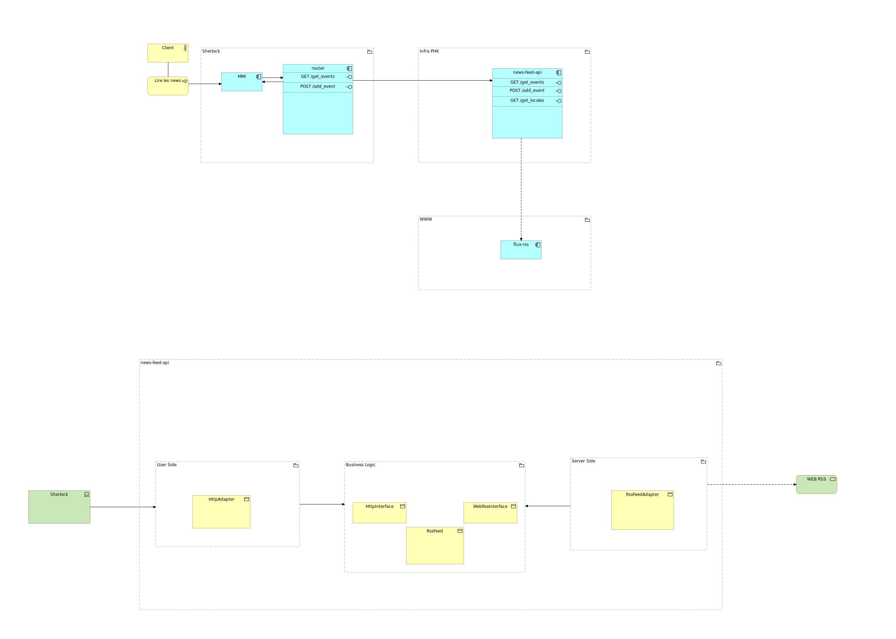

# Prohacktive PHP News Feed API

---

- Created at: 2023/05/05
- Updated at: 2023/05/05
- Version: 0.1
- Author: Bertrand SOURIAU (bsu@prohacktive.io), Alexandre ANDRÉ (a.andre@prohacktive.io)
- Client: Prohacktive (https://prohacktive.io)
- Project URL:
  - development: http://localhost:8700
  - phpmyadmin: http://localhost:8780/
- Development PHP: >=7.3.30
- Project dependencies:
  - composer: >=2.0.9

## Main Goal

Manage and aggregate internal and external sources to feed some interfaces with news.

Needs :

- Multi languages support
- Add/Remove external RSS
- Add/Remove internal news



## Folders and files structure

## How to install the program with docker

### Requirements

- make
- docker
- docker-compose

### Init project (Optionnal)

Clone the project and launch commands

### Build Image
  
```bash
make build
```

### Run containers

```bash
make up
```

### Initialize database

```bash
make db-init
```

Wait until all containers started.

```bash
# All containers have to be up
make ps
```

### Test it

```bash
curl --location --request GET 'http://localhost:8082/health' \
```

### Create database

```bash
make db-init
```

## Development tips

### PHP formatter using VSCode

- This project uses the `PHP Intelephense` PHP formatter extension.
